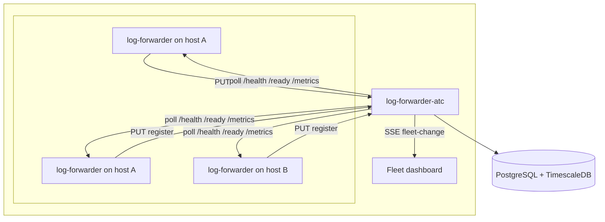

# Log Forwarder ATC

[](https://github.com/sanjuthomas/log-forwarder-atc/actions/workflows/maven.yml)
[](LICENSE)

Air Traffic Controller for **[log-forwarder](https://github.com/sanjuthomas/log-forwarder)** agents. Agents register on startup; ATC stores registry data in PostgreSQL and polls each agent every **30 seconds** for health, readiness, and metrics. Registration and deregistration are pushed to the fleet dashboard over SSE; health/ready status continues on the scheduled poll. Metric snapshots are stored in a **TimescaleDB** hypertable (PostgreSQL extension) for time-series queries. A built-in **fleet dashboard** at `/` shows registered agents and live status.

## Architecture



Each live agent is uniquely identified by **`hostname` + `port`**, so multiple forwarders on the same host are supported when they listen on different ports. **`process_id`** is still sent on registration and validated on `/health` and `/ready` probes to confirm the process currently bound to that port. **Reachability** (`REACHABLE`, `UNREACHABLE`, `UNKNOWN`) is derived from polling and used for filtering—not as part of the registry key.

## Timeseries storage

**TimescaleDB** is used because it:

- Extends PostgreSQL (one operational stack)
- Is open source
- Provides hypertables, retention policies, and time-bucket aggregations for dashboards

Alternatives for later: InfluxDB, VictoriaMetrics, or Prometheus remote write.

Metric retention is not enforced by ATC today; configure [TimescaleDB retention policies](https://docs.timescale.com/use-timescale/latest/data-retention/create-a-retention-policy/) at the database level when you need automatic pruning.

## Quick start

### Option A: Docker Compose (database + app)

```bash
docker compose up -d --build
```

Open **http://localhost:8090/** for the fleet dashboard.

### Option B: Local development

#### 1. Start the database

```bash
docker compose up -d timescaledb
```

#### 2. Run ATC

```bash
./mvnw spring-boot:run
```

ATC listens on **8090** by default.

#### 3. Open the fleet dashboard

Open **http://localhost:8090/** in a browser.

The dashboard is a static page served from `src/main/resources/static/index.html` (same pattern as [kafka-web-clients](https://github.com/sanjuthomas/kafka-web-clients)). It loads fleet status from `GET /api/instances` and listens for live updates on `GET /api/instances/events` (Server-Sent Events). Registration and deregistration refresh the table immediately; health, ready, and metrics refresh on the **30 second** poll cycle (or immediately after an agent registers). Use **Refresh now** for a manual update.

**Summary cards** at the top show fleet counts. Click a card to filter the agent table below:

| Card | Meaning | Table view |
|------|---------|------------|
| Registered | Total agents in the registry | All registered agents (default) |
| Reachable | Agents ATC could reach on the last poll | Registered agents with `REACHABLE` status |
| Unreachable | Agents that failed all probes | Registered agents with `UNREACHABLE` status |
| Unknown | Newly registered agents not polled yet | Registered agents with `UNKNOWN` status |
| Deregistered | Total agents deregistered since ATC started (cumulative) | Historical deregistered agents (separate table) |

The active card is highlighted with a blue border. **Deregistered** shows agents removed via `DELETE /api/instances`; the count is cumulative and history is kept even after the live instance and metric snapshots are deleted.

**Agent table** columns:

| Column | Description |
|--------|-------------|
| Host | Hostname and instance UUID |
| Process ID | Current OS process ID (validated on health/ready probes) |
| Reachability | `REACHABLE`, `UNREACHABLE`, or `UNKNOWN` |
| Health / Ready | Result of the latest `/health` and `/ready` probes |
| Forwarder metrics | Tile grid: files watched, lines published/read, pipeline buffer, sink state |
| Port | Agent HTTP port (health, ready, and metrics) |
| Last poll | Timestamp of the latest metrics snapshot |
| Registered | Registration time and agent start time |

When **Deregistered** is selected, the table shows: Host, Process ID, Port, Registered, and Deregistered (timestamp).

Status badges use green (up / reachable), red (down / unreachable), and gray (unknown / not polled). If no agents are registered, an empty state explains that agents must call `PUT /api/instances` on startup.

Poll data appears after ATC’s first scheduled poll (default **every 30 seconds**), or immediately when an agent registers. The dashboard receives **registration** and **deregistration** events over SSE and reloads the fleet table right away.

**Forwarder metrics panel** (per agent):

| Tile / pill | Source metric | Notes |
|-------------|---------------|-------|
| Files | `log_forwarder_files_watched` | Log files currently tailed |
| Published | `log_forwarder_lines_published_total` | Lines sent to the sink |
| Read | `log_forwarder_lines_read_total` + `log_forwarder_lines_replayed_total` | Total lines ingested (new tail + restart replays) |
| Buffer | `log_forwarder_pipeline_buffer_depth` | Highlighted when backlog &gt; 0 |
| Sink | `log_forwarder_publish_hibernating` | OK or Hibernating badge |

### 4. Register an agent

**Request body** (`PUT /api/instances`, `Content-Type: application/json`):

| Field | Type | Description |
|-------|------|-------------|
| `hostname` | string | Host where the agent runs |
| `port` | integer | Single HTTP port for `/health`, `/ready`, and `/metrics` (1–65535) |
| `process_id` | integer | Current OS process ID; validated on health/ready probes |
| `timestamp` | string (ISO-8601) | Agent start time (UTC), e.g. `2026-06-11T14:30:00Z` |

```bash
curl -X PUT http://localhost:8090/api/instances \
  -H 'Content-Type: application/json' \
  -d '{
    "hostname": "app-server-01",
    "port": 8080,
    "process_id": 12345,
    "timestamp": "2026-06-11T14:30:00Z"
  }'
```

Returns **`201 Created`** for a new agent or **`200 OK`** when re-registering the same `hostname` + `port` (updates `process_id` and `timestamp` after a restart). ATC immediately probes `/health`, `/ready`, and `/metrics` for the agent and broadcasts a dashboard update over SSE.

**Example response** (`201 Created`):

```json
{
  "id": "5fa00872-bd58-44f2-b3a0-d0653fba5fd8",
  "hostname": "app-server-01",
  "process_id": 12345,
  "timestamp": "2026-06-11T14:30:00Z",
  "port": 8080,
  "registered_at": "2026-06-11T23:08:51.269683Z",
  "reachability": "UNKNOWN",
  "created": true
}
```

Re-registration with the same `hostname` + `port` updates `process_id` and `timestamp` (typical agent restart) and returns `"created": false`.

### Deregister an agent

Call on graceful shutdown so ATC stops polling and removes the instance (metric history is deleted via cascade). Lookup uses **`hostname` + `port`** only; `process_id` and `timestamp` are accepted for agent compatibility but ignored.

```bash
curl -X DELETE http://localhost:8090/api/instances \
  -H 'Content-Type: application/json' \
  -d '{
    "hostname": "app-server-01",
    "port": 8080,
    "process_id": 12345,
    "timestamp": "2026-06-11T15:00:00.123456789Z"
  }'
```

Returns `204 No Content` on success, `404` if no matching instance exists. ATC records the agent in deregistration history, increments the fleet **Deregistered** counter, and broadcasts a **deregistration** SSE event to connected dashboards.

### 5. REST API

| Method | Path | Description |
|--------|------|-------------|
| PUT | `/api/instances` | Register or update an agent |
| DELETE | `/api/instances` | Deregister an agent (`hostname` + `port`; extra fields ignored) |
| GET | `/api/instances` | All registered agents with latest poll snapshot |
| GET | `/api/instances/{id}` | Single agent status |
| GET | `/api/instances/stats` | Fleet counters (`deregistered_total`) |
| GET | `/api/instances/deregistered` | Deregistered agent history (newest first) |
| GET | `/api/instances/events` | SSE stream of registration/deregistration events (`fleet-change`) |
| GET | `/api/instances/{id}/metrics?lookbackMinutes=60` | Time-series snapshots |
| GET | `/` | Fleet dashboard UI |

Interactive API docs (OpenAPI) are available at **http://localhost:8090/swagger-ui.html** when ATC is running.

**SSE event** (`event: fleet-change`):

```json
{
  "type": "REGISTERED",
  "instance_id": "5fa00872-bd58-44f2-b3a0-d0653fba5fd8",
  "hostname": "app-server-01",
  "process_id": 12345
}
```

`type` is `REGISTERED` or `DEREGISTERED`.

The JSON returned by `GET /api/instances` powers the dashboard. Each entry includes `latest_metrics` from the most recent poll:

```json
{
  "id": "5d8e7aa8-6c69-404e-8ecb-b27868d36f0d",
  "hostname": "app-server-01",
  "process_id": 12345,
  "port": 8080,
  "timestamp": "2026-06-11T14:30:00Z",
  "registered_at": "2026-06-11T14:30:05Z",
  "reachability": "REACHABLE",
  "latest_metrics": {
    "captured_at": "2026-06-11T20:01:00Z",
    "health_up": true,
    "ready_up": true,
    "files_watched": 1,
    "lines_published": 68,
    "lines_read": 56,
    "lines_replayed": 13,
    "pipeline_buffer_depth": 0,
    "publish_hibernating": false,
    "process_cpu_utilization": 1.3,
    "process_memory_usage": 52428800,
    "poll_error": null
  }
}
```

**Fleet stats** (`GET /api/instances/stats`):

```json
{
  "deregistered_total": 3
}
```

**Deregistered history** (`GET /api/instances/deregistered`):

```json
[
  {
    "id": "11111111-2222-3333-4444-555555555555",
    "instance_id": "5fa00872-bd58-44f2-b3a0-d0653fba5fd8",
    "hostname": "app-server-01",
    "process_id": 12345,
    "port": 8080,
    "registered_at": "2026-06-11T14:30:05Z",
    "deregistered_at": "2026-06-11T15:00:00Z"
  }
]
```

## Agent contract (expected by ATC)

When ATC polls an agent it calls all endpoints on the registered **port**:

| Probe | URL | Success |
|-------|-----|---------|
| Health | `http://{hostname}:{port}/health` | HTTP 2xx + JSON body with matching `process_id` |
| Ready | `http://{hostname}:{port}/ready` | HTTP 2xx + JSON body with matching `process_id` |
| Metrics | `http://{hostname}:{port}/metrics` | HTTP 2xx + OpenMetrics/Prometheus text body |

Expected health JSON:

```json
{
  "status": "UP",
  "process_id": 12345
}
```

Expected ready JSON:

```json
{
  "status": "READY",
  "process_id": 12345
}
```

The `process_id` in each probe response must match the value registered via `PUT /api/instances`. A mismatch marks that probe as down and is recorded in `poll_error`.

Expected metrics excerpt (OpenMetrics text). ATC parses these series for the dashboard:

| Prometheus metric | Dashboard field |
|-------------------|-----------------|
| `log_forwarder_files_watched` | Files watched |
| `log_forwarder_lines_published_total` | Lines published |
| `log_forwarder_lines_read_total` | Newly appended lines read |
| `log_forwarder_lines_replayed_total` | Lines re-read after restart (stale watermark) |
| `log_forwarder_pipeline_buffer_depth` | Pipeline buffer depth |
| `log_forwarder_publish_hibernating` | Sink hibernating (`1` = failing) |
| `process_cpu_utilization_ratio` | Process CPU (% of one core; `1.3` = 1.3%) |
| `process_memory_usage_bytes` | Process memory (bytes) |

Example:

```text
log_forwarder_files_watched 1
log_forwarder_lines_published_total 68
log_forwarder_lines_read_total 69
log_forwarder_pipeline_buffer_depth 0
log_forwarder_publish_hibernating 0
process_cpu_utilization_ratio 1.3
process_memory_usage_bytes 52428800
```

Paths are configurable via `atc.agent.*` in `application.yml`.

## Configuration

| Variable | Default | Description |
|----------|---------|-------------|
| `SERVER_PORT` | `8090` | ATC HTTP port |
| `DB_HOST` | `localhost` | PostgreSQL host |
| `DB_PORT` | `5432` | PostgreSQL port |
| `DB_NAME` | `log_forwarder_atc` | Database name |
| `DB_USER` / `DB_PASSWORD` | `atc` / `atc` | Credentials |
| `ATC_POLLING_INTERVAL_MS` | `30000` | Poll interval for `/health`, `/ready`, and `/metrics` (fixed delay) |

## Build

```bash
./mvnw clean package
```

## Tests

```bash
./mvnw verify
```

Unit and web-layer tests cover registration/deregistration (including SSE broadcast hooks and deregistration history), Prometheus metrics parsing, health/ready `process_id` validation, fleet stats endpoints, and bundled dashboard assets (including clickable summary-card filters).

Integration tests use **Testcontainers** with TimescaleDB to verify Flyway migrations and end-to-end registration against a real database (requires Docker).

## CI

GitHub Actions runs `./mvnw verify` on push, pull requests, and version tags (JDK 21). JaCoCo coverage reports are uploaded as workflow artifacts. See `.github/workflows/maven.yml`.

Tagged releases (`v*`) build a JAR and attach it to a GitHub Release. See `.github/workflows/release.yml`.

## Contributing

Contributions are welcome. See [CONTRIBUTING.md](CONTRIBUTING.md) for build instructions and PR guidelines.

## Related projects

- [log-forwarder](https://github.com/sanjuthomas/log-forwarder) — the log tailing agent monitored by ATC
- [kafka-web-clients](https://github.com/sanjuthomas/kafka-web-clients) — similar static-dashboard pattern used for the fleet UI

## License

Licensed under the [Apache License 2.0](LICENSE).

## Next steps (out of scope for v0.1)

- Service discovery for dynamic Docker/K8s endpoints
- TTL / auto-pruning for stale agents that never deregister
- Alerting on unreachable agents
- Per-instance metrics charts on the dashboard
