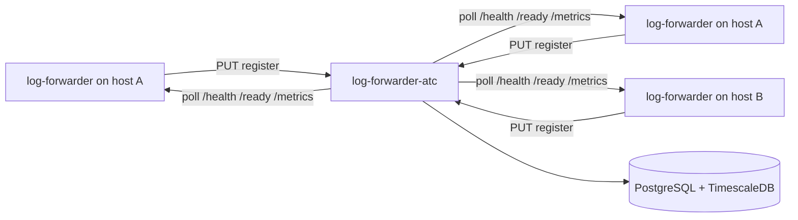

# Log Forwarder ATC

Air Traffic Controller for **log-forwarder** agents. Agents register on startup; ATC stores registry data in PostgreSQL and polls each agent every minute for health, readiness, and metrics. Metric snapshots are stored in a **TimescaleDB** hypertable (PostgreSQL extension) for time-series queries.

## Architecture



Each agent is uniquely identified by **`hostname` + `pid`**, so multiple forwarders on the same host are supported.

## Timeseries storage

**TimescaleDB** is used because it:

- Extends PostgreSQL (one operational stack)
- Is open source
- Provides hypertables, retention policies, and time-bucket aggregations for dashboards

Alternatives for later: InfluxDB, VictoriaMetrics, or Prometheus remote write.

## Quick start

### 1. Start the database

```bash
docker compose up -d
```

### 2. Run ATC

```bash
./mvnw spring-boot:run
```

ATC listens on **8090** by default. Open **http://localhost:8090/** for the fleet dashboard (auto-refreshes every 30 seconds from `GET /api/instances`).

### 3. Register an agent

```bash
curl -X PUT http://localhost:8090/api/instances \
  -H 'Content-Type: application/json' \
  -d '{
    "hostname": "my-host",
    "startTime": "2026-06-11T16:00:00Z",
    "healthPort": 8081,
    "readyPort": 8082,
    "metricsPort": 8083,
    "pid": 12345
  }'
```

Re-registration with the same `hostname` + `pid` updates ports and start time (agent restart).

### Deregister an agent

Call on graceful shutdown so ATC stops polling and removes the instance (metric history is deleted via cascade):

```bash
curl -X DELETE http://localhost:8090/api/instances \
  -H 'Content-Type: application/json' \
  -d '{
    "hostname": "my-host",
    "pid": 12345
  }'
```

Returns `204 No Content` on success, `404` if no matching instance exists.

### 4. Dashboard APIs

| Method | Path | Description |
|--------|------|-------------|
| PUT | `/api/instances` | Register or update an agent |
| DELETE | `/api/instances` | Deregister an agent (`hostname` + `pid`) |
| GET | `/api/instances` | All registered agents with latest poll snapshot |
| GET | `/api/instances/{id}` | Single agent status |
| GET | `/api/instances/{id}/metrics?lookbackMinutes=60` | Time-series snapshots |
| GET | `/` | Fleet dashboard (static UI) |

## Agent contract (expected by ATC)

When ATC polls an agent it calls:

| Probe | URL | Success |
|-------|-----|---------|
| Health | `http://{hostname}:{healthPort}/health` | HTTP 2xx |
| Ready | `http://{hostname}:{readyPort}/ready` | HTTP 2xx |
| Metrics | `http://{hostname}:{metricsPort}/metrics` | HTTP 2xx + JSON body |

Expected metrics JSON:

```json
{
  "filesMonitored": 12,
  "eventsProcessed": 450000,
  "bytesRead": 987654321
}
```

Paths are configurable via `atc.agent.*` in `application.yml`.

## Configuration

| Variable | Default | Description |
|----------|---------|-------------|
| `SERVER_PORT` | `8090` | ATC HTTP port |
| `DB_HOST` | `localhost` | PostgreSQL host |
| `DB_PORT` | `5432` | PostgreSQL port |
| `DB_NAME` | `log_forwarder_atc` | Database name |
| `DB_USER` / `DB_PASSWORD` | `atc` / `atc` | Credentials |
| `ATC_POLLING_INTERVAL_MS` | `60000` | Poll interval (fixed delay) |

## Build

```bash
./mvnw clean package
```

## Next steps (out of scope for v0.1)

- Service discovery for dynamic Docker/K8s endpoints
- Deregistration / TTL for stale agents
- Web dashboard UI
- Alerting on unreachable agents
