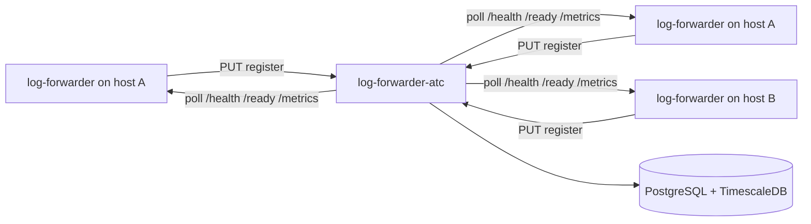

# Log Forwarder ATC

Air Traffic Controller for **log-forwarder** agents. Agents register on startup; ATC stores registry data in PostgreSQL and polls each agent every minute for health, readiness, and metrics. Metric snapshots are stored in a **TimescaleDB** hypertable (PostgreSQL extension) for time-series queries. A built-in **fleet dashboard** at `/` shows registered agents and live status.

## Architecture



Each agent is uniquely identified by **`hostname` + `process_id`**, so multiple forwarders on the same host are supported. Health, readiness, and metrics are exposed on a **single port**.

## Timeseries storage

**TimescaleDB** is used because it:

- Extends PostgreSQL (one operational stack)
- Is open source
- Provides hypertables, retention policies, and time-bucket aggregations for dashboards

Alternatives for later: InfluxDB, VictoriaMetrics, or Prometheus remote write.

## Quick start

### 1. Start the database

```bash
docker compose up -d
```

### 2. Run ATC

```bash
mvn spring-boot:run
```

ATC listens on **8090** by default.

### 3. Open the fleet dashboard

Open **http://localhost:8090/** in a browser.

The dashboard is a static page served from `src/main/resources/static/index.html` (same pattern as [kafka-web-clients](https://github.com/sanjuthomas/kafka-web-clients)). It polls `GET /api/instances` and refreshes automatically every **30 seconds**. Use **Refresh now** for an immediate update.

**Summary cards** at the top show fleet counts:

| Card | Meaning |
|------|---------|
| Registered | Total agents in the registry |
| Reachable | Agents ATC could reach on the last poll |
| Unreachable | Agents that failed all probes |
| Unknown | Newly registered agents not polled yet |

**Agent table** columns:

| Column | Description |
|--------|-------------|
| Host | Hostname and instance UUID |
| Process ID | Process ID (unique per host) |
| Reachability | `REACHABLE`, `UNREACHABLE`, or `UNKNOWN` |
| Health / Ready | Result of the latest `/health` and `/ready` probes |
| Metrics | Files monitored, events processed, and bytes read |
| Port | Agent HTTP port (health, ready, and metrics) |
| Last poll | Timestamp of the latest metrics snapshot |
| Registered | Registration time and agent start time |

Status badges use green (up / reachable), red (down / unreachable), and gray (unknown / not polled). If no agents are registered, an empty state explains that agents must call `PUT /api/instances` on startup.

Poll data appears after ATC’s first scheduled poll (default **every 60 seconds**), so a newly registered agent may show `UNKNOWN` briefly before the first snapshot.

### 4. Register an agent

```bash
curl -X PUT http://localhost:8090/api/instances \
  -H 'Content-Type: application/json' \
  -d '{
    "hostname": "app-server-01",
    "port": 8080,
    "process_id": 12345,
    "timestamp": "2026-06-11T14:30:00Z"
  }'
```

Re-registration with the same `hostname` + `process_id` updates port and timestamp (agent restart).

### Deregister an agent

Call on graceful shutdown so ATC stops polling and removes the instance (metric history is deleted via cascade):

```bash
curl -X DELETE http://localhost:8090/api/instances \
  -H 'Content-Type: application/json' \
  -d '{
    "hostname": "app-server-01",
    "process_id": 12345
  }'
```

Returns `204 No Content` on success, `404` if no matching instance exists.

### 5. REST API

| Method | Path | Description |
|--------|------|-------------|
| PUT | `/api/instances` | Register or update an agent |
| DELETE | `/api/instances` | Deregister an agent (`hostname` + `process_id`) |
| GET | `/api/instances` | All registered agents with latest poll snapshot |
| GET | `/api/instances/{id}` | Single agent status |
| GET | `/api/instances/{id}/metrics?lookbackMinutes=60` | Time-series snapshots |
| GET | `/` | Fleet dashboard UI |

The JSON returned by `GET /api/instances` powers the dashboard. Each entry includes `latest_metrics` from the most recent poll:

```json
{
  "id": "5d8e7aa8-6c69-404e-8ecb-b27868d36f0d",
  "hostname": "app-server-01",
  "process_id": 12345,
  "port": 8080,
  "timestamp": "2026-06-11T14:30:00Z",
  "registered_at": "2026-06-11T14:30:05Z",
  "reachability": "REACHABLE",
  "latest_metrics": {
    "captured_at": "2026-06-11T20:01:00Z",
    "health_up": true,
    "ready_up": true,
    "files_monitored": 12,
    "events_processed": 450000,
    "bytes_read": 987654321,
    "poll_error": null
  }
}
```

## Agent contract (expected by ATC)

When ATC polls an agent it calls all endpoints on the registered **port**:

| Probe | URL | Success |
|-------|-----|---------|
| Health | `http://{hostname}:{port}/health` | HTTP 2xx |
| Ready | `http://{hostname}:{port}/ready` | HTTP 2xx |
| Metrics | `http://{hostname}:{port}/metrics` | HTTP 2xx + JSON body |

Expected metrics JSON:

```json
{
  "filesMonitored": 12,
  "eventsProcessed": 450000,
  "bytesRead": 987654321
}
```

Paths are configurable via `atc.agent.*` in `application.yml`.

## Configuration

| Variable | Default | Description |
|----------|---------|-------------|
| `SERVER_PORT` | `8090` | ATC HTTP port |
| `DB_HOST` | `localhost` | PostgreSQL host |
| `DB_PORT` | `5432` | PostgreSQL port |
| `DB_NAME` | `log_forwarder_atc` | Database name |
| `DB_USER` / `DB_PASSWORD` | `atc` / `atc` | Credentials |
| `ATC_POLLING_INTERVAL_MS` | `60000` | Poll interval (fixed delay) |

## Build

```bash
mvn clean package
```

## CI

GitHub Actions runs `mvn verify` on push, pull requests, and version tags (JDK 21). See `.github/workflows/maven.yml`.

## Next steps (out of scope for v0.1)

- Service discovery for dynamic Docker/K8s endpoints
- TTL / auto-pruning for stale agents that never deregister
- Alerting on unreachable agents
- Per-instance metrics charts on the dashboard
